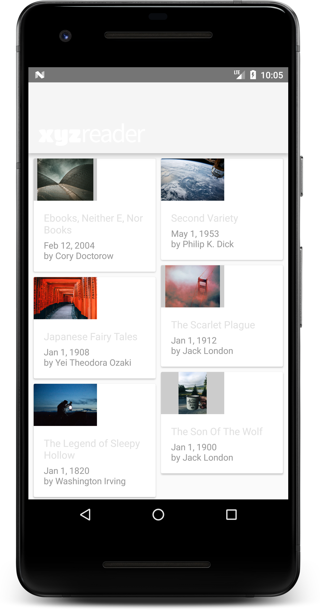
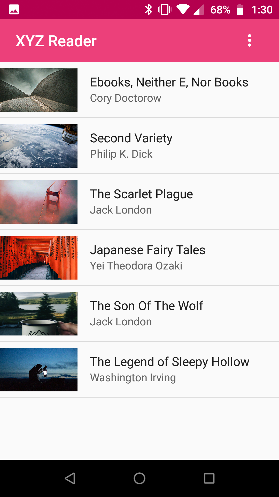
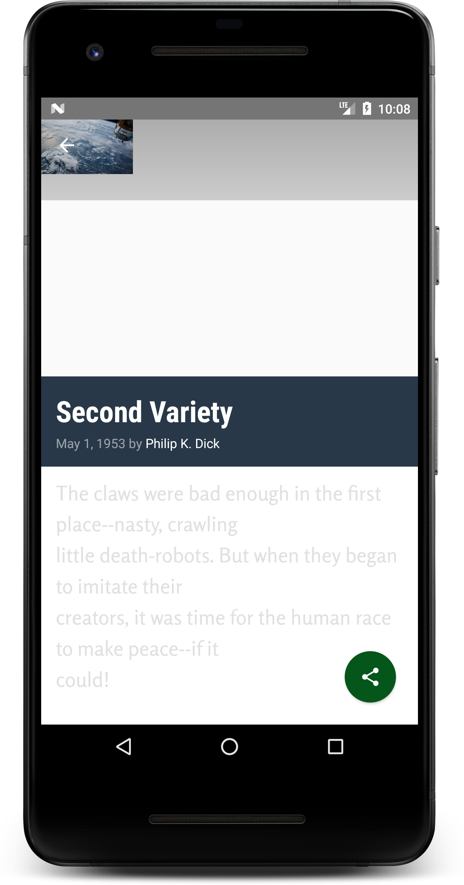
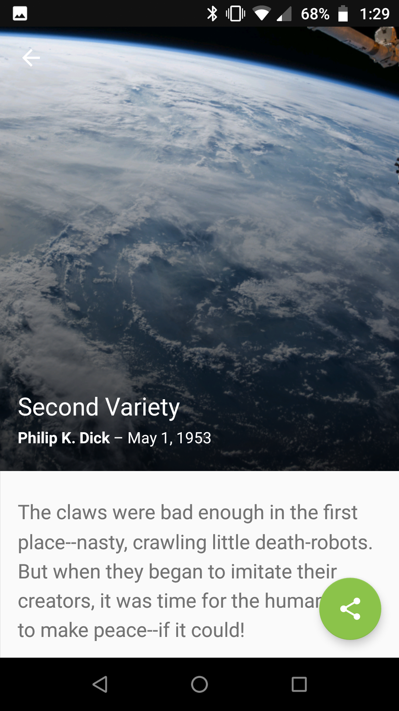

# XYZ Reader

This is an implementation of Udacity's Android Nanodegree project 6.

The purpose of this project is to update app starter code to use [Material Design](https://material.io/design/).

<strong><a href='https://github.com/nkrusch/XYZReader/releases'>Compiled APK available here »</a></strong>

## Modifications

<table>
<tr>
<td> ✔️ Added theme colors </td>
<td> ✔️ Fixed text contrast </td></tr><tr>
<td> ✔️ Replaced cards with material list (small device) </td>
<td> ✔️ Replaced cards with material image list (tablet) </td></tr><tr>
<td> ✔️ Added collapsing toolbar </td>
<td> ✔️ Fixed FAB position during transition </td></tr><tr>
<td> ✔️ Custom ViewPager page transform </td>
<td> ✔️ Added menu to main activity </td></tr><tr>
<td> ✔️ Improved image utilization i.e. full bleed </td>
<td> ✔️ Added text paging to improve load time </td>
</tr>
</table>

## Screenshots

<table>
  <tr>
    <th width="48%">Before</th>
    <th width="48%">After</th>
  </tr>
  <tr>
    <td>
      
    </td>      
    <td>
      
    </td>      
  </tr>
  
  <tr>
    <td>
      
    </td>      
    <td>
      
    </td>      
  </tr>
  </table>
